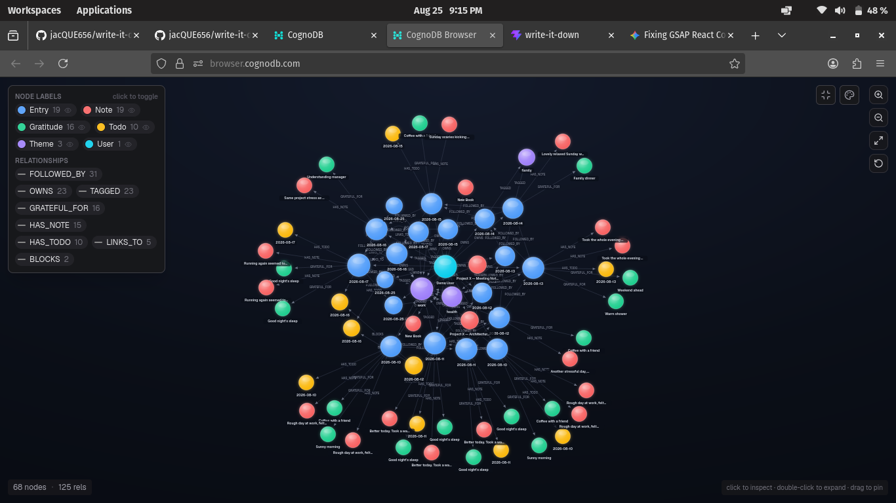

# Write It Down — Backend (`write-it-down-server`)

REST API for **Write It Down**, a daily reflection notepad built on **CognoDB**, a managed graph database. This repo is the server half of the project — see [`write-it-down`](../write-it-down) for the frontend.

Write It Down lets you write structured daily reflections (mood, gratitude, achievements, challenges, todos) and long-form standalone notes (class notes, project notes), and automatically weaves everything together by shared themes, chronology, wiki-style links, and dependencies — so you can ask questions like *"what happened after days like today?"* instead of just scrolling back through old entries. You can also share individual notes and todos with other users by email.

---

## Why a graph database?

A daily journal *looks* like a simple CRUD app — entries, todos, tags — and a relational schema could store all of that. But the interesting features of Write It Down aren't about storing entries, they're about the **connections between them**:

- **"Show me days similar to today, and what happened the day after"** — this means traversing Entry → Theme → other Entries → the next day's Entry. In SQL this is a multi-way self-join or a recursive CTE per hop. In Cypher, it's a single readable pattern match.
- **Recurring gratitude and themes** — finding patterns that repeat across many entries is a graph aggregation, not a simple filter.
- **Todo dependency chains** ("this todo is blocked by that one, which is blocked by another") — variable-length traversal (`BLOCKS*0..`) is native to graph databases and awkward to express in SQL.
- **Chronological + associative links** — each entry links to the next day *and* can be manually linked to any other day it reminds you of, forming a real web rather than a straight list.
- **Related long-form notes** — notes surface each other through shared themes *or* through a wiki-style link web, within 2 hops — the same "discover connections you didn't explicitly make" idea, applied to notes instead of days.
- **Sharing as a graph edge, not a permissions table** — a shared note or todo is just a `SHARED_WITH` edge pointing at another `User` node. "Who can see this" is answered by a traversal, the same way every other question in this app is.

A graph database lets these questions be expressed as simple, readable pattern matches instead of layered joins — and performs well even as the number of entries and cross-links grows.

---

## Data Model

### Nodes

| Label | Properties |
|---|---|
| `Entry` | `date`, `moodScore` (1–10), `selfCare` (bool), `quote` |
| `Todo` | `text`, `done` (bool), `createdAt` |
| `Theme` | `name` (e.g. "work", "family", "health") |
| `Gratitude` | `text` |
| `Note` | `title`, `body` (long-form text), `createdAt`, `updatedAt` |
| `User` | `email`, `name`, `avatarUrl`, `googleId` (if Google), `passwordHash` + `authProvider` (if email/password) |

### Relationships

| Relationship | Direction | Meaning |
|---|---|---|
| `OWNS` | `User → Entry`, `User → Note` | Entry or note belongs to this signed-in user |
| `HAS_TODO` | `Entry → Todo` | Todo created from this day's entry |
| `HAS_NOTE` | `Entry → Note` | Quick note jotted as part of this entry (optional) |
| `REFERENCES` | `Entry → Note` | Entry points to a longer standalone note (e.g. "worked on Project X" → the Project X note) |
| `BLOCKS` | `Todo → Todo` | One todo waits on another |
| `TAGGED` | `Entry → Theme`, `Note → Theme` | Entry or note touches this theme |
| `GRATEFUL_FOR` | `Entry → Gratitude` | Gratitude item logged that day |
| `FOLLOWED_BY` | `Entry → Entry` | Chronological link, day → next day |
| `LINKS_TO` | `Entry → Entry`, `Note → Note` | Manual cross-reference — "this reminds me of that day," or a wiki-style link between long-form notes |
| `SHARED_WITH` | `Note → User`, `Todo → User` | The owner has shared this note or todo with another user by email |

### Diagram


*Actual seed data rendered in the CognoDB browser — `Demo User` fanning out through two weeks of `Entry` nodes into their `Todo`, `Note`, `Theme`, and `Gratitude` neighbors.*

---

## Tech Stack

**Backend:** Node.js + Express
- `neo4j-driver` — official Neo4j JavaScript driver, used to connect to CognoDB over Bolt
- `dotenv` — reads connection credentials from environment variables
- `google-auth-library` — verifies Google Sign-In ID tokens
- `bcrypt` — hashes passwords for email/password accounts
- `jsonwebtoken` + `cookie-parser` — issues and validates app session cookies after sign-in (shared by both auth methods)
- REST API exposing entries, todos, notes, search, and sharing to the frontend

**Authentication:** Google Sign-In *or* email/password
- **Google:** frontend gets an ID token from Google → backend verifies it and finds/creates a `User` node
- **Email/password:** standard sign-up and login, password hashed with bcrypt before storage — never stored or logged in plain text
- Both methods issue the same httpOnly session cookie, so the rest of the app doesn't need to know which one a user chose
- All entries, todos, and notes are scoped to the signed-in user via `OWNS`

**Database:** CognoDB Cloud (managed graph database, openCypher over Bolt)

**Hosting (free tier):** Render / Railway

---

## Setup & Run Instructions

### 1. Create a CognoDB Cloud instance

1. Sign up at [console.cognodb.com/signup](https://console.cognodb.com/signup) (free tier, no credit card required).
2. Create a free (c0) instance and choose a region. Provisioning takes under a minute.
3. Copy the connection URI (`bolt+s://<instance-id>.databases.cognodb.cloud`) and the generated password for user `cognodb` — the password is shown once.
4. Store these as environment variables (see `.env.example`). Never commit credentials to the repo.

### 2. Create Google OAuth credentials

1. Go to the [Google Cloud Console](https://console.cloud.google.com/) → APIs & Services → Credentials.
2. Create an **OAuth 2.0 Client ID** (type: Web application).
3. Add your local dev frontend URL (e.g. `http://localhost:5173`) and your deployed frontend URL to **Authorized JavaScript origins**.
4. Copy the generated **Client ID** — the *same* Client ID is used by both this backend and the [`write-it-down`](../write-it-down) frontend.

### 3. Install, configure, seed, run

```bash
npm install
```

Create `.env` from `.env.example`:
```
COGNODB_URI=bolt+s://<instance-id>.databases.cognodb.cloud
COGNODB_USER=cognodb
COGNODB_PASSWORD=<your-password>

GOOGLE_CLIENT_ID=<your-google-oauth-client-id>
SESSION_SECRET=<a-long-random-string>

PORT=4000
CLIENT_ORIGIN=http://localhost:5173
```

Seed the database:
```bash
npm run seed
```
This creates a demo user (`demo@writeitdown.app` / `demopassword123`) with two weeks of sample entries, todos, themes, gratitude items, and notes — including a todo dependency chain and a recurring "work stress" theme, so the multi-hop queries return meaningful results immediately.

Run the server:
```bash
npm run dev
```
The API starts on `http://localhost:4000`. Check `GET /health` to confirm CognoDB is reachable — if the database is unreachable, the server still starts and this endpoint reports the problem clearly instead of the app crashing.

---

## Main Queries Explained

### 1. Seed a day's entry with todos and themes
```cypher
CREATE (e:Entry {date: $date, moodScore: $mood, selfCare: $selfCare, quote: $quote})
WITH e
UNWIND $todos AS todoText
CREATE (t:Todo {text: todoText, done: false, createdAt: $date})
CREATE (e)-[:HAS_TODO]->(t)
WITH e
UNWIND $themes AS themeName
MERGE (th:Theme {name: themeName})
CREATE (e)-[:TAGGED]->(th)
```
Creates a new entry along with its todos and themes in one parameterised write.

### 2. "Days like today" (multi-hop traversal)
```cypher
MATCH (today:Entry {date: $date})-[:TAGGED]->(theme:Theme)<-[:TAGGED]-(past:Entry)
WHERE past.date < today.date
MATCH (past)-[:FOLLOWED_BY]->(nextDay:Entry)
RETURN past.date AS pastEntry, theme.name AS sharedTheme,
       nextDay.moodScore AS moodAfter, nextDay.date AS nextDate
ORDER BY nextDay.moodScore DESC
```
Finds past entries sharing a theme with today, then surfaces what mood followed the next day — a "here's what helped last time" insight. Three hops deep; awkward as a recursive self-join in a relational database.

### 3. Recurring gratitude
```cypher
MATCH (g:Gratitude)<-[:GRATEFUL_FOR]-(e:Entry)
WITH g.text AS item, count(e) AS mentions, collect(e.date) AS dates
WHERE mentions > 1
RETURN item, mentions, dates
ORDER BY mentions DESC
```
Surfaces gratitude items that recur across multiple entries.

### 4. Stalled todos
```cypher
MATCH (e:Entry)-[:HAS_TODO]->(t:Todo {done: false})
MATCH path = (t)<-[:BLOCKS*0..]-(blocker:Todo)
RETURN t.text AS todo, e.date AS since, length(path) AS blockedDepth
ORDER BY blockedDepth DESC
```
Uses variable-length traversal to find todos buried under dependency chains.

### 5. Mood trend across linked days
```cypher
MATCH (e:Entry)-[:FOLLOWED_BY*1..7]->(later:Entry)
WHERE e.date = $date
RETURN later.date, later.moodScore
ORDER BY later.date
```
Traces mood over the week following a given entry.

### 6. Related notes (long-form notes, multi-hop)
```cypher
MATCH (n:Note) WHERE id(n) = $noteId
OPTIONAL MATCH (n)-[:TAGGED]->(:Theme)<-[:TAGGED]-(byTheme:Note)
OPTIONAL MATCH (n)-[:LINKS_TO*1..2]-(byLink:Note)
RETURN byTheme, byLink
```
Surfaces notes related to the one you're reading — either through a shared theme, or reachable within two hops of manual wiki-style links.

### 7. Search across everything
```cypher
MATCH (u:User {email: $userEmail})-[:OWNS]->(n:Note)
WHERE toLower(n.title) CONTAINS $q OR toLower(n.body) CONTAINS $q
RETURN 'note' AS type, ...
UNION
MATCH (u:User {email: $userEmail})-[:OWNS]->(e:Entry)-[:HAS_TODO]->(t:Todo)
WHERE toLower(t.text) CONTAINS $q
RETURN 'todo' AS type, ...
UNION
MATCH (u:User {email: $userEmail})-[:OWNS]->(e:Entry)
OPTIONAL MATCH (e)-[:TAGGED]->(th:Theme)
WHERE toLower(coalesce(e.quote,'')) CONTAINS $q OR any(tn IN collect(th.name) WHERE toLower(tn) CONTAINS $q)
RETURN 'entry' AS type, ...
```
One query, three node types, one results feed — a relational version would need a separate query per table plus app-level merging.

### 8. Sharing and access
```cypher
MATCH (n:Note) WHERE id(n) = $noteId
MATCH (owner:User)-[:OWNS]->(n)
WHERE owner.email = $userEmail
   OR EXISTS { (n)-[:SHARED_WITH]->(:User {email: $userEmail}) }
```
Access control expressed as a traversal: a note is visible if you own it *or* if it's connected to you by a `SHARED_WITH` edge. No separate permissions table.

---

## Demo

- **Hosted demo:** *(link to be added)*
- **Screen recording:** *(link to be added)*

---

## Project Structure

```
write-it-down-server/
├── assets/
│   └── graph-visualization.jpg  # rendered seed-data graph, used in this README
├── src/
│   ├── db.js                    # neo4j-driver connection, reads env vars
│   ├── index.js                 # Express app, route mounting, health check
│   ├── auth/
│   │   ├── google.js            # Google ID token verification, session middleware
│   │   └── password.js          # email/password signup and login
│   ├── controllers/
│   │   ├── auth.js
│   │   ├── entries.js
│   │   ├── graph.js
│   │   ├── notes.js
│   │   ├── search.js
│   │   └── todos.js
│   ├── queries/                 # Cypher queries as named, parameterised functions
│   │   ├── entries.js
│   │   ├── graph.js
│   │   ├── notes.js
│   │   ├── search.js
│   │   └── todos.js
│   ├── routes/
│   │   ├── auth.js
│   │   ├── entries.js
│   │   ├── graph.js
│   │   ├── notes.js
│   │   ├── search.js
│   │   └── todos.js
│   └── seed/
│       └── seed.js              # loads sample data
├── .env.example
├── package.json
└── README.md
```
